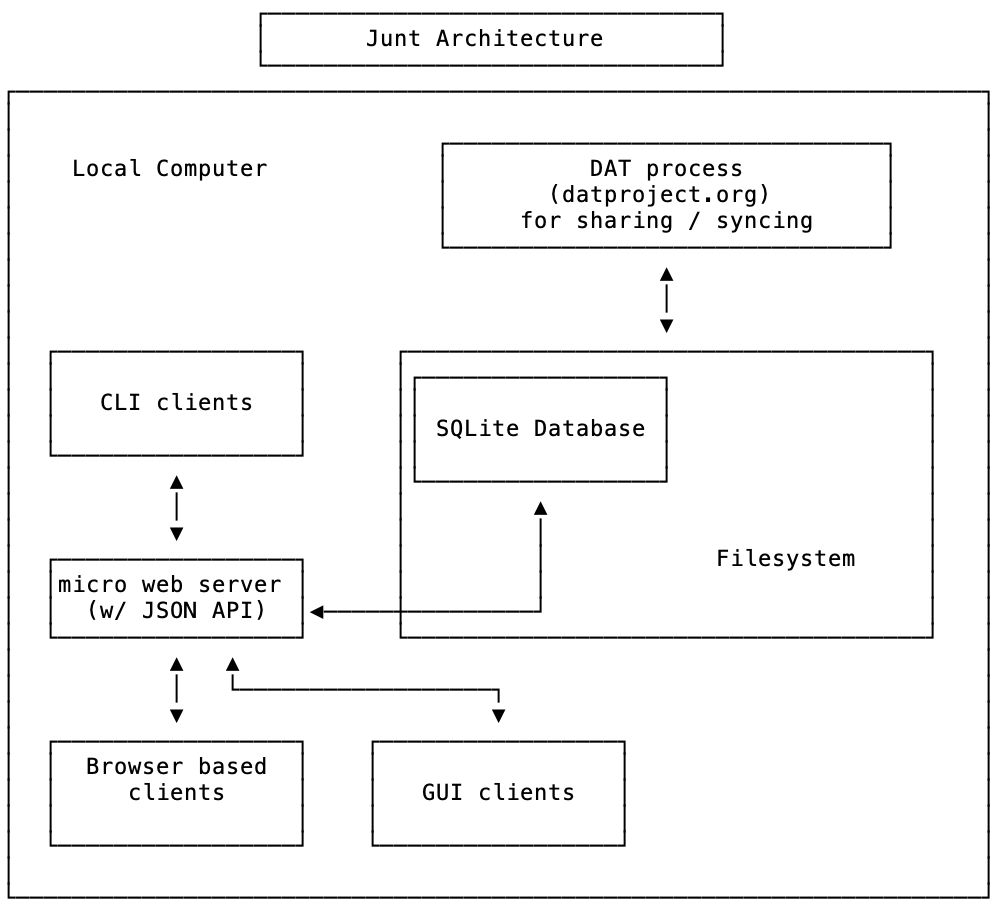
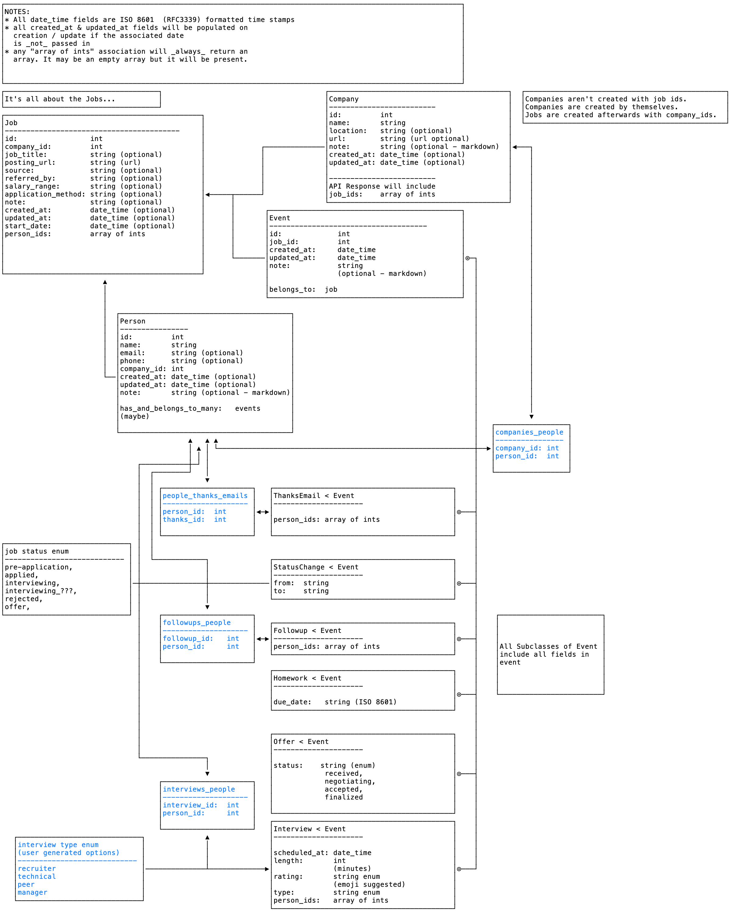

## Welcome Friend

Welcome to the pre-alpha version of Junt (Job + Hunt = Junt).

Here's what you need to know get started.

### What Is Junt?
Ultimately Junt is a tool for tracking and managing your job hunt. It will help you to keep track of who you applied to, when your interviews are/were scheduled, who you've already talked to, and what you talked to them about. 

It's also a resource for developers who need to point to some code they've written as proof of their familiarity with a given technology. This is achievable because we've broken Junt into two pieces. 


The core of Junt is a tiny web server with a simple REST API. The server runs locally, and its API allows you to create and retrieve all the objects you'll need to track your job hunt. 

The client(s) are written in whatever language and framework you feel like using. You're encouraged to choose something that'll help in your job hunt. 

#### Current Status
The web server is about 90% complete. You can find it in the [junt_server](https://github.com/masukomi/junt_server) repo. masukomi is improving the JSON it produces almost daily. See the `#junt` channel in slack for status updates as they become available.

Side note: we're still undecided if it should live in this repo or not. 

#### Infrastructure

The basic architecture is/will be this: 



Right now we've just got the server. The client is up to you. The [DAT](https://dat.foundation/) integration will come later. 

Note: the thinking behind using DAT is that it's free, easy, and doesn't require us (or anyone) to host any servers to sync user's data.

#### Data Model
(Note that the blue join tables/objects are NOT directly accessible via the API). 


**Important notes**: Every object has an endpoint for create, view, update, delete, and list. The exception to this is Event. The Event endpoint is read only, but all the subclasses of event have read/write endpoints.

We've started documenting the API in this repo under `site/content/`

The `site` directory contains the setup for the [Hugo](https://gohugo.io) site that will host the API docs when this becomes public. 

You can `cd` into there and run `hugo server` to launch a Hugo server that will render them in their HTML glory (with much more readable tables). Or you can just preview them directly in your favorite Markdown preview app that supports GitHub Flavored Markdown.




## Running The Server

Since we're still  pre-alpha running the server means building the server. It's written with [Golang](https://golang.org/) so you'll need that installed. After that...

Clone the [junt_server](https://github.com/masukomi/junt_server) repo. 

Then run 
```
go build junt.go
```
in the root directory.

That should produce a `junt` binary. Just run it and it'll set up a database at `~/.config/junt/junt.db`. If you'd like to specify a different location you can set the `JUNT_DB` environment variable with a path to where you'd like the db file. For example: 

```bash
$ JUNT_DB="~/stick/it/here.db" junt
```

If compiling it yourself is an issue, please talk to masukomi and they'll get you an executable for your OS. Non-trivial changes are happening almost daily so you're advised to update and build regularly.

